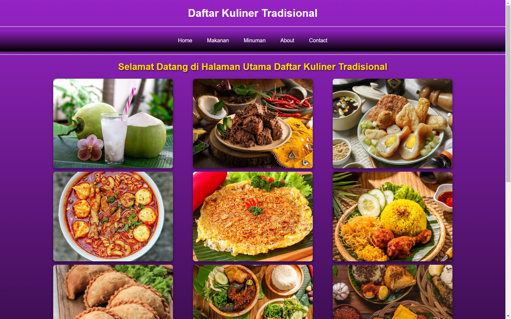

## Web Kuliner
| UAS  |  Pemrograman WEB 1  |
|-------|---------
| **NIM**   | 312310576
| **Nama** | Taufik Hidayat
| **Kelas** | TI.23.A6
| **Mata Kuliah**    |     Pemrograman WEB 1    |
| **Dosen Pengampu** |Eko Budiarto, S.Kom., M.M.  |

**Perintah UAS:**

- Buatlah sebuah aplikasi CRUD sederhana dengan menggunakan tambahan Bootstrap 5
dan Datatables.

*Pengertian CRUD:*

- CRUD app adalah aplikasi perangkat lunak yang melakukan operasi dasar Create, Read, Update, dan Delete (CRUD) pada data. CRUD merupakan fungsi utama yang diimplementasikan dalam aplikasi database. 

### Penampilan :

